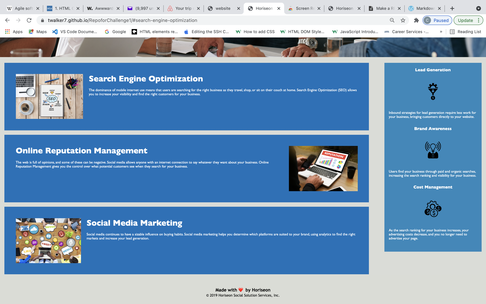

# Basic Landing Page 

 ## The purpose of this page is to advertise a business-to-business marketing service. ##

 ## Page Contents ----

### There is a navigation bar at the top of the page with links to each section/service on the page 

### A jumbotron illustrates a team of consultants at work

### 3 services are listed vertically below the jumbotron

### 3 corresponding benefits of each service are listed vertically to the right of the page

## ----

## My Contribution to this Project: 

#### I was tasked with refactoring this page to increase it's accessibility for users, and code readbility for developers. To improve accessibility, I added alt attributes to the img elements, changed the title to a more descriptive one, and repaired one off the internal links in the navigation bar. To clean the code, I consolidated a number of CCS property specifications to classes that applied to multiple elements.

### 2 page snapshots & link : 
#### 

####  

##### Here is a link to Horiseon live deployment: https://twalker7.github.io/RepoforChallenge1/#search-engine-optimization

